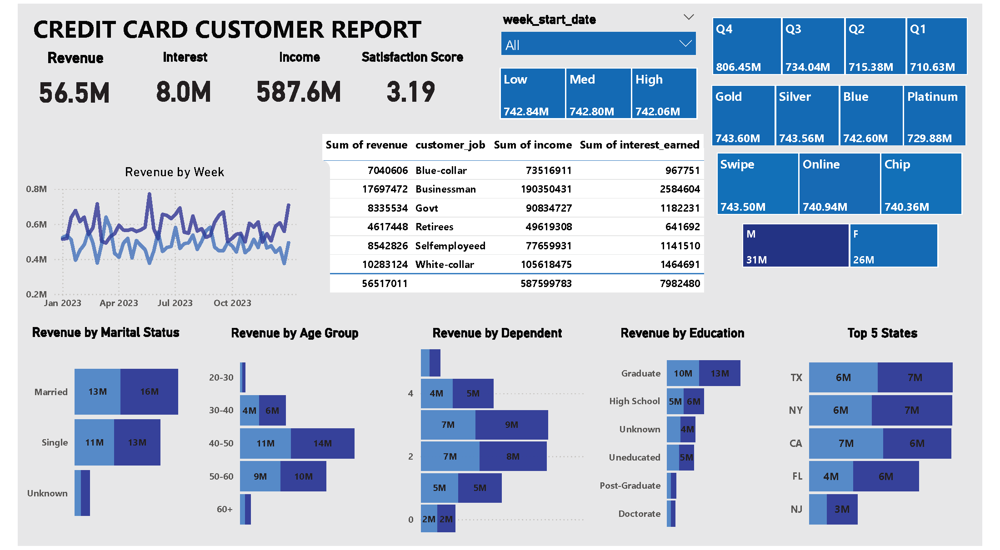
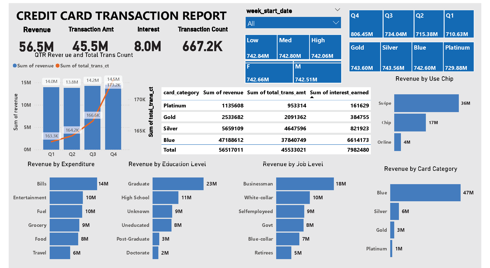

# Credit Card Financial Dashboard using Power BI and SQL

This project presents a weekly credit card dashboard developed in Power BI with backend data integration through SQL. The goal was to monitor key financial metrics, customer behavior, and operational performance to drive actionable insights.

---

##  Objective

To enable real-time tracking of revenue, interest, income, and customer trends by visualizing weekly credit card operations through an interactive dashboard.

---

##  Dataset Overview

- **Source**: Imported from SQL database (`cust_detail`, `cc_detail` tables)
- **Time Frame**: Full year (2023)
- **Records**: 667,200+ transactions
- **Metrics Covered**: Revenue, transaction amount, interest, income, satisfaction score, activation and delinquency rates

---

##  Key Insights

- **Total Revenue**: $56.5M  
- **Total Interest**: $8M  
- **Total Transaction Amount**: $45.5M  
- **Customer Distribution**: $31M from male, $26M from female customers  
- **Card Usage**: 93% of transactions made with Blue and Silver cards  
- **Top States**: TX, NY, and CA contributed 68% of total revenue  
- **Weekly Growth**: Revenue rose by 28.8% in Week 53 (Dec 31st)  
- **Activation Rate**: 57.5%  
- **Delinquency Rate**: 6.06%

---

## Tools & Technologies

- **SQL**: Data cleaning, table creation, and import operations
- **Power BI**: Visualizations, KPI tracking, and dashboard layout
- **DAX**: Custom measures (e.g., AgeGroup, IncomeGroup, week_num2, Revenue calculations)

---

## Dashboard Features

- Filters for quarter, income group, gender, card type, and payment method
- Revenue breakdowns by:
  - Age group, education level, marital status, dependent count
  - Card category, job role, and transaction method
- Dual-axis line and bar charts for time-series comparison
- KPI cards for real-time overview of financial performance

---

## Folder Contents

- `credit_card_customer_report.png` – Customer-focused financial report
- `credit_card_transaction_report.png` – Transaction-based performance breakdown
- `Credit Card Financial Weekly Dashboard Report.pdf` – Full project documentation and DAX queries
- `data` – Customer and Credit Card Information in csv
- `additional data` – cust_ad and cc_add data in csv

---

## 📸 Preview

